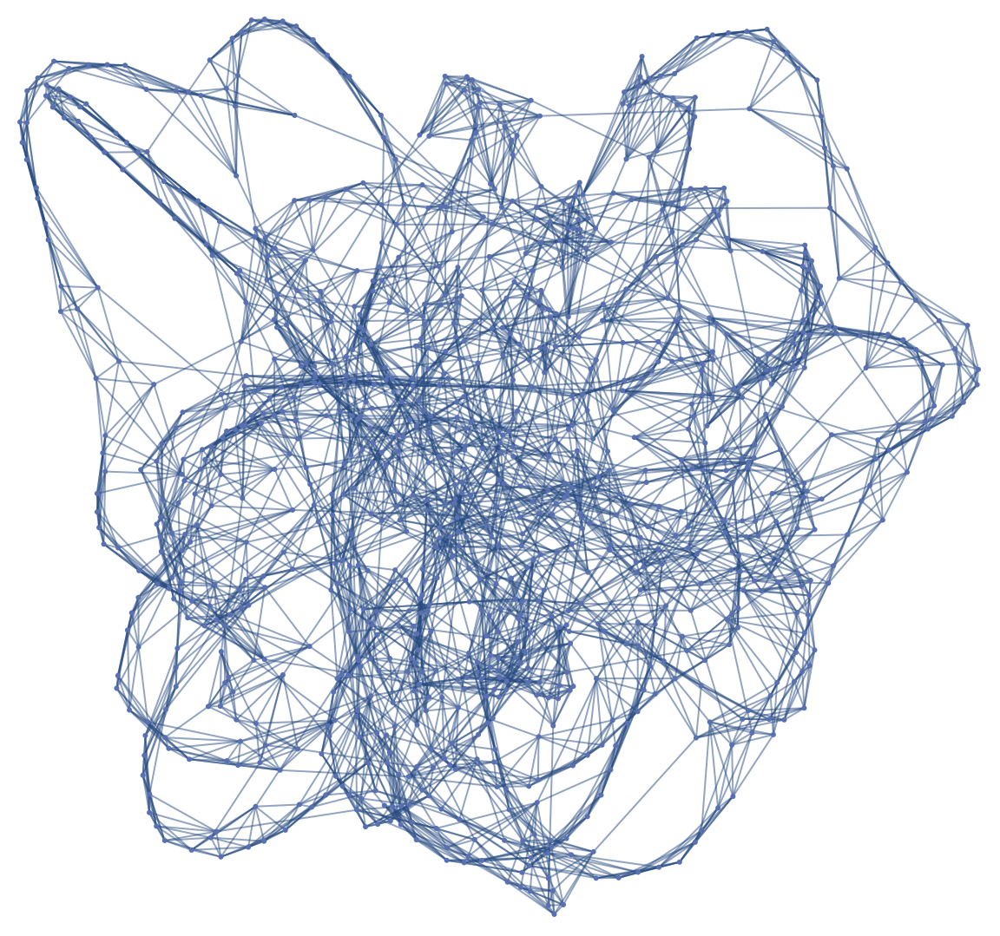
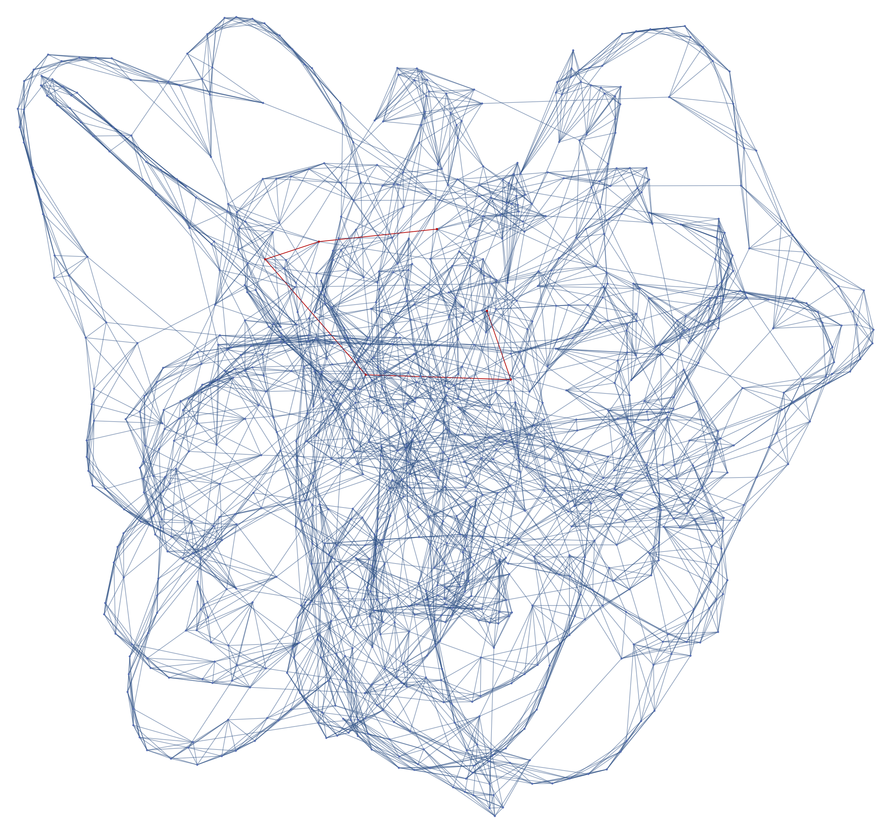
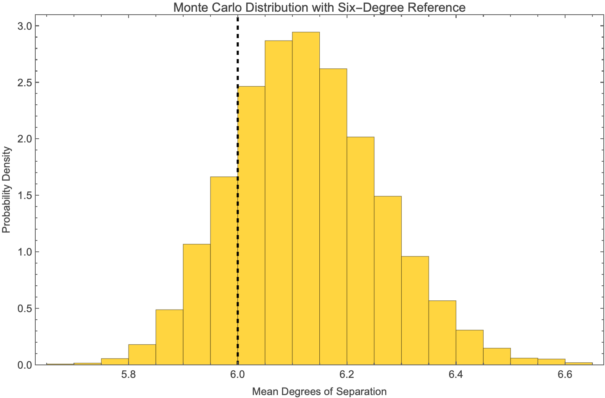

# Degrees of Seperation

This is a concept that I've been curious about for a while. It turns out that any two people on the planet can be connected through just a linkage of 6 relationships. In fact, I'm pretty sure the number dropped because of expanded internet access. People often say "small world" for lighthearted things like meeting someone you know, but this really put it into perspective into me. You share some set of similarities with all 8 billion people on Earth. It really is a small world. 

This metric was so astonishing to me that I needed to test it myself. But how could I do this? I surely can't simulate 8 billion agents on my computer. I could instead use graphs. 

The Watts Strogatz small world network worked perfectly for this. In essence, there's a set of interconnected nodes. Each node has a rewiring probability, meaning there is a chance that the node conncets to another. This represents a relationship. With really large populations, it can create intricate networks filled with connections. 

Here is a graph with 1000 nodes and 5% rewiring probability.

The main significance of a 0.05 rewiring probability is to maintain things like families and relatives for which agents have direct, hierarchical relation to one another. I did a little bit of research on Google and it seemed like 5% was a good estimate for reality.

In Mathematica, the program I'm using to generate these visuals, the average shortest path length is 6.2, which is really close to the metric I was inspired by! That's awesome. 

Here's a highlighted graph that shows the connection between 2 random nodes. (hopefully the red is not hard to see)

The best way to do these kinds of analysis is with something called a Monte Carlo run. All this means that we run the simulation multiple times and see what happens. I wanted to get some useful statistics out of the run, so I made a histogram of 5000 trails of the same 1000 node graph in order to find the true mean graph distance (degree of seperation).

The distance really is around 6. With the addition of social media, some complexities arise. There are significantly more interactions that you have, especially from people you may have never seen across the world. Is this connection a good thing? 

Maybe.

In one case, it unites people from across the world, enabling cooperation. This is fundamental for development to happen. In the other case, this also gives opportunities for negative things to spread easily. In a study by Meta, they found that the mean degrees of seperation bewteen any two people on their services (Instragram, Facebook, WhatsApp etc.) was a mere 3.57.